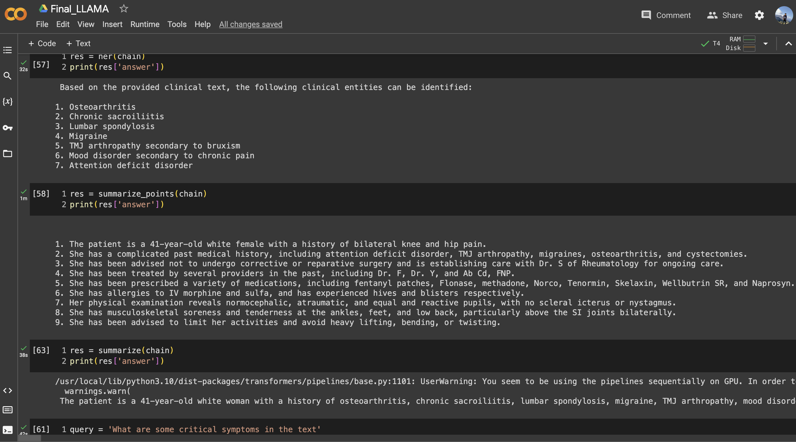
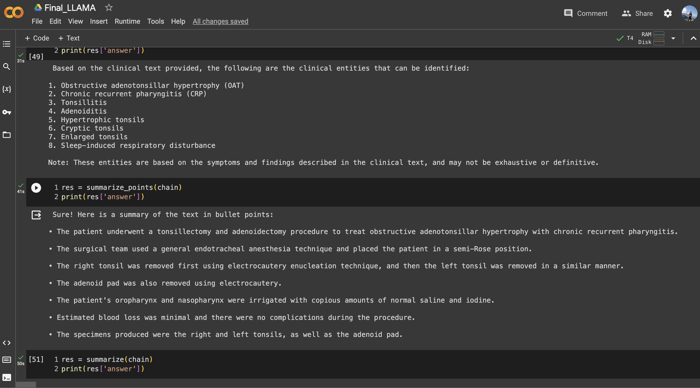

# LLAMA Project README

## Introduction

I embarked on the LLAMA project, an ambitious undertaking that leverages state-of-the-art technologies and resources for clinical Natural Language Processing (NLP). It encompasses three main tasks, Clinical NER Extraction, Information Retrieval, and Summarization, each employing cutting-edge methods to achieve its objectives.

## Project Structure

1. Clinical NER Extraction
2. Information Retrieval
3. Summarization

## Clinical NER Extraction

### Task Overview

The Clinical NER Extraction task involves extracting key information from clinical text data, a critical task in healthcare and medical research.

### Methods Used

For this task, I harnessed the power of Prompt Engineering and the Embeddings Method, utilizing the LLM model (Llama-2-13b-chat-hf), Langchain, and FAISS.

### Procedure

I followed a structured procedure for Clinical NER Extraction:

1. Applying Prompt Engineering
2. Utilizing Embeddings for NER
3. Post-processing and Evaluation

## Information Retrieval

### Task Overview

Information Retrieval focuses on retrieving relevant documents from a vast corpus of medical literature.

### Method Used

I employed the Embeddings Method powered by sentence-transformers/all-mpnet-base-v2 for this task, utilizing the LLM model (Llama-2-13b-chat-hf), Langchain, and FAISS.

### Procedure

My approach to Information Retrieval consisted of the following steps:

1. Embeddings-Based Document Retrieval
2. Relevance Scoring
3. Document Selection and Ranking

## Summarization

### Task Overview

Summarization aims to provide concise and informative summaries of medical documents.

### Method Used

I harnessed the power of sentence-transformers/all-mpnet-base-v2 for generating informative summaries, utilizing the LLM model (Llama-2-13b-chat-hf), Langchain, and FAISS.

### Procedure

My Summarization procedure included the following step:

1. Abstractive Summarization

## Approach to the Solution

The solution for each task is designed with a focus on simplicity and reproducibility. In each task section, I provide detailed steps and methods used, making it easy for the evaluator or others to replicate my results. You can replicate the results by running the [Final_LLAMA](Final_LLAMA.ipynb) notebook in the order. 

## Evaluation

For evaluation, I have used the [Kaggle](https://www.kaggle.com/datasets/tboyle10/medicaltranscriptions) dataset. This dataset has 5000 diversified clinical texts. 

## Improvement

We can fine-tune the LLAMA-2 model for each specific task. Since we already have a basic [dataset](mtsamples.csv) available to us, there should be no problem in finetuning LLAMA-2 except for resources. 

## Results

I have included the results in CSV files and in the code output of the [Final_LLAMA](Final_LLAMA.ipynb) notebook. 

Here's a screenshot of the results from my LLAMA project:

